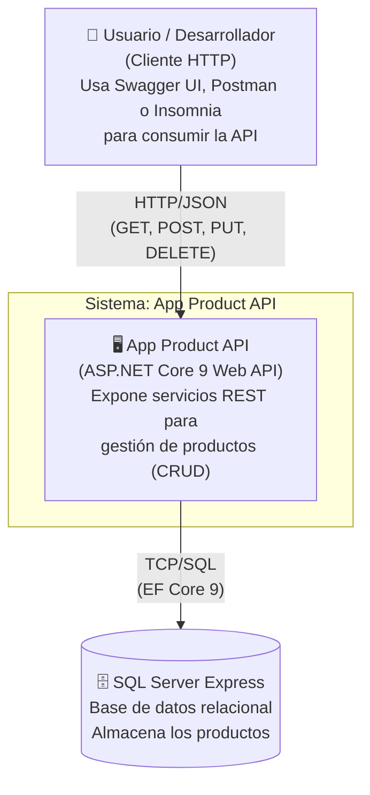

# C4 Nivel 1 — Diagrama de Contexto del Sistema

## Descripción

El diagrama de contexto muestra el sistema **App Product API** en su entorno más amplio: quién lo usa y con qué sistemas externos se comunica. Es el nivel más alto de abstracción del modelo C4.

## Elementos

| Elemento | Tipo | Descripción |
|---|---|---|
| Usuario / Desarrollador | Persona | Cualquier cliente HTTP que consume la API (Swagger, Postman, Insomnia, app frontend). |
| App Product API | Sistema de software | Backend REST que expone operaciones CRUD sobre productos. Es el sistema en foco. |
| SQL Server Express | Sistema externo | Motor de base de datos relacional local donde se persisten los datos. |

## Decisiones de diseño relevantes

- El sistema **no expone autenticación** en esta versión porque la actividad no la requiere. El endpoint de versionado `/api/v1/` facilita agregar seguridad en `/api/v2/` sin romper clientes existentes.
- La comunicación con SQL Server usa **Trusted Connection** (autenticación de Windows) para simplificar el entorno de desarrollo local.
