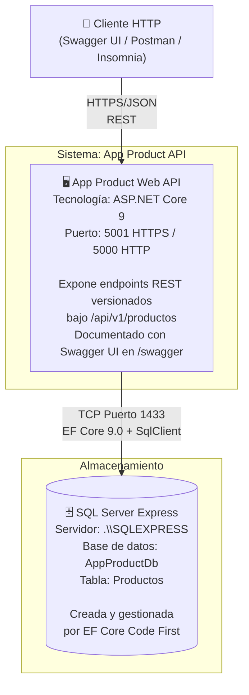

# C4 Nivel 2 — Diagrama de Contenedores

## Descripción

El diagrama de contenedores hace zoom dentro del sistema "App Product API" y muestra los **contenedores desplegables** (procesos o almacenes de datos ejecutables de forma independiente).

## Responsabilidades por contenedor

### App Product Web API

- Recibe y valida solicitudes HTTP.
- Aplica las reglas de negocio a través de la capa de Aplicación.
- Gestiona errores con `ExceptionHandlingMiddleware` (ProblemDetails RFC 7807).
- Persiste y recupera datos a través de EF Core.
- Expone documentación interactiva en `/swagger` (solo en Development).

### SQL Server Express

- Almacena los registros de productos.
- La tabla `Productos` fue creada por la migración `InitialCreate` de EF Core (Code First).
- No requiere scripts SQL manuales. Todo se gestiona desde el modelo de dominio.

## Tecnologías por contenedor

| Contenedor | Lenguaje | Framework | Versión |
|---|---|---|---|
| Web API | C# | ASP.NET Core | 9.0 |
| Base de datos | T-SQL | SQL Server Express | Local |
