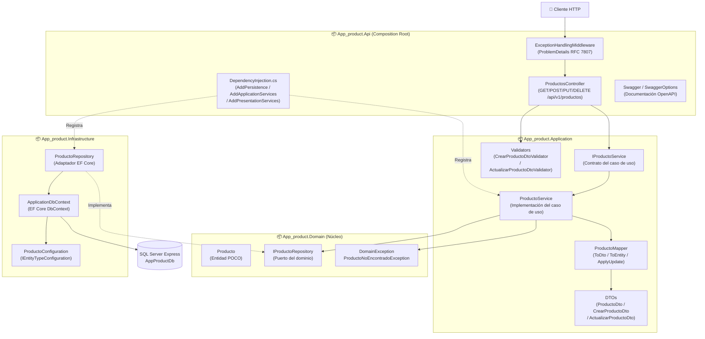

# C4 Nivel 3 — Diagrama de Componentes

## Descripción

Hace zoom dentro del contenedor **App Product Web API** y muestra sus componentes internos organizados en las **cuatro capas de Clean Architecture**. Este es el diagrama más importante para evidenciar la separación de responsabilidades.



## Flujo de una solicitud POST /api/v1/productos

1. El cliente envía `POST /api/v1/productos` con un JSON `CrearProductoDto`.
2. `ExceptionHandlingMiddleware` envuelve la solicitud.
3. `ProductosController.Crear()` recibe el DTO y lo valida con `CrearProductoDtoValidator`.
4. Si es válido, llama a `IProductoService.CrearAsync(dto)`.
5. `ProductoService` convierte el DTO a entidad con `ProductoMapper.ToEntity()`.
6. `ProductoService` llama a `IProductoRepository.AgregarAsync(entidad)`.
7. `ProductoRepository` persiste con EF Core y retorna la entidad con Id asignado.
8. `ProductoService` mapea la entidad a `ProductoDto` y retorna al controller.
9. El controller retorna `201 Created` con el `ProductoDto` y el header `Location`.

## Regla de dependencias cumplida

```
Api  →  Application  →  Domain  (sin dependencias)
Api  →  Infrastructure  →  Domain
```

- `Domain` no importa ningún proyecto externo.
- `Application` no importa `Infrastructure`: nunca toca EF Core directamente.
- `Infrastructure` implementa el puerto `IProductoRepository` del Dominio.
- Solo `Api` conoce a todas las capas (Composition Root).
