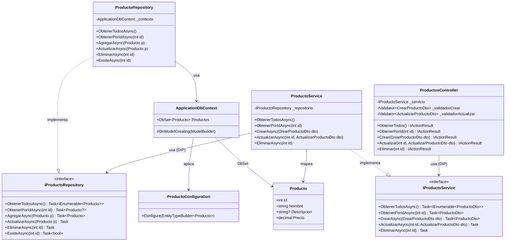

# C4 Nivel 4 — Diagrama de Código

## Justificación

Se incluye este nivel porque el proyecto es pequeño (una sola entidad) y permite evidenciar con precisión las relaciones entre clases y las interfaces clave que sostienen la arquitectura.

## Diagrama de clases simplificado

## Notas sobre el diseño

- Las flechas de uso (`-->`) siempre apuntan hacia abstracciones (interfaces) o el dominio.
- `ProductosController` nunca referencia `ProductoService` directamente: solo conoce `IProductoService`.
- `ProductoService` nunca referencia `ProductoRepository`: solo conoce `IProductoRepository`.
- Esta cadena de inversiones es la materialización del **Principio de Inversión de Dependencias (DIP)**.
