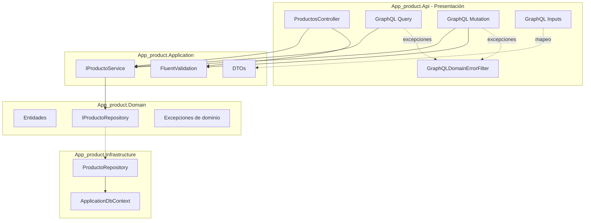

# GraphQL y Arquitectura Limpia

## Principio rector

GraphQL es un **protocolo de presentación**, al mismo nivel que HTTP/REST. Por eso todo artefacto GraphQL vive en `App_product.Api` y **nunca** en `Domain` ni `Application`.



## Regla de Dependencia

Las flechas de código fuente solo apuntan hacia adentro:

| Capa | ¿Conoce GraphQL / Hot Chocolate? | ¿Conoce IProductoService? |
|---|---|---|
| **Domain** | No | No (solo interfaces de dominio) |
| **Application** | No | Sí (es el dueño del contrato) |
| **Infrastructure** | No | Implementa `IProductoRepository` |
| **Api** | Sí (única capa con GraphQL) | Sí (consume el puerto) |

Ningún paquete NuGet de ChilliCream está referenciado en `App_product.Domain.csproj` ni `App_product.Application.csproj`.

## Inversión de Dependencias (DIP)

Los resolvers **no** inyectan `ProductoService`, `ProductoRepository` ni `ApplicationDbContext`. Solo dependen de abstracciones ya usadas por REST:

```csharp
// Query.cs — mismo patrón DIP que ProductosController
public sealed class Query
{
    private readonly IProductoService _servicio;
    public Query(IProductoService servicio) => _servicio = servicio;
    // ...
}
```

Hot Chocolate resuelve `Query` y `Mutation` desde el contenedor DI de ASP.NET Core. En el Composition Root (`DependencyInjection.cs`) ambas clases se registran como **scoped** (`AddScoped<Query>()`, `AddScoped<Mutation>()`), alineadas con `IProductoService` y `ApplicationDbContext`, para que cada petición GraphQL use su propio contexto de EF Core.

## Responsabilidad Única (SRP)

| Componente | Responsabilidad |
|---|---|
| `Query` / `Mutation` | Orquestar la petición GraphQL: mapear inputs, validar, llamar al servicio. |
| `IProductoService` | Casos de uso de negocio (CRUD). |
| `GraphQLDomainErrorFilter` | Traducir excepciones a errores GraphQL (equivalente al middleware REST). |
| `ProductoInputMapper` | Convertir tipos de transporte GraphQL → DTOs de Application. |
| `ExceptionHandlingMiddleware` | Errores HTTP/REST (ProblemDetails). |

## Aislamiento del contrato de transporte

Los **Inputs** (`ProductoCrearInput`, `ProductoActualizarInput`) duplican la forma de los DTOs pero viven en `Api.GraphQL.Inputs`. Si el esquema GraphQL evoluciona, Application no se ve afectada.

Internamente los resolvers trabajan con `ProductoDto` (Application). En el **esquema público** el tipo se expone como `Producto` mediante [`ProductoType`](../../src/App_product.Api/GraphQL/Types/ProductoType.cs): el cliente GraphQL no ve el sufijo `Dto`.

## Validación compartida

Las mutaciones GraphQL usan los **mismos validadores FluentValidation** que el controlador REST:

- `IValidator<CrearProductoDto>`
- `IValidator<ActualizarProductoDto>`

Las reglas de negocio no se duplican en los resolvers.

## Manejo de errores paralelo

| Excepción | REST (`ExceptionHandlingMiddleware`) | GraphQL (`GraphQLDomainErrorFilter`) |
|---|---|---|
| `ProductoNoEncontradoException` | HTTP 404 + ProblemDetails | `code: PRODUCTO_NO_ENCONTRADO`, `statusCode: 404` |
| `ValidationException` | HTTP 400 | `code: VALIDATION_ERROR`, `statusCode: 400` |
| `DomainException` | HTTP 422 | `code: DOMAIN_ERROR`, `statusCode: 422` |
| Otras | HTTP 500 | `code: INTERNAL_SERVER_ERROR`, `statusCode: 500` |

Hot Chocolate captura excepciones **dentro del motor GraphQL**; el middleware REST no transforma errores de `/graphql` de la misma forma, por eso existe el filtro dedicado.

## Guardrail automatizado: Regla 11

El proyecto [`tests/App_product.ArchTests`](../../tests/App_product.ArchTests/Architecture/CapasTests.cs) incluye la **Regla 11**: todo tipo en el namespace `App_product.Api.GraphQL` y las clases cuyo nombre termina en `Query` o `Mutation` deben residir en el ensamblado `App_product.Api`.

Esto impide que GraphQL “se filtre” a capas internas por accidente.

## Lo que no cambió con GraphQL

- Entidades de dominio (`Producto`).
- `ProductoService` y `IProductoService`.
- Repositorio EF Core e infraestructura.
- Controlador REST `ProductosController` (sin modificaciones).
- Migraciones y esquema de base de datos.
