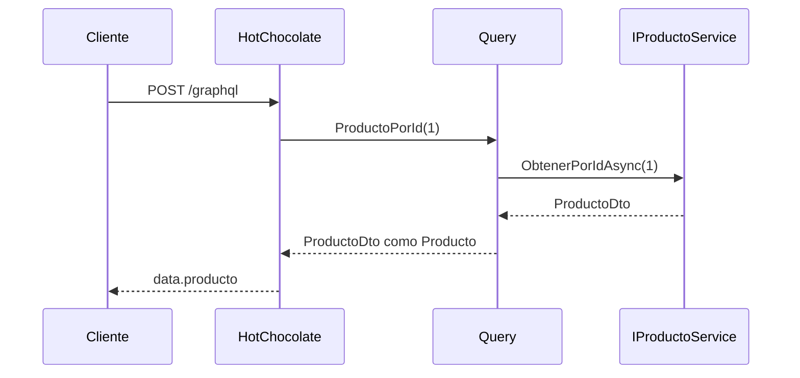

# Implementación con Hot Chocolate — Paso a paso

## Resumen de archivos

| Paso | Archivo | Acción |
|---|---|---|
| 1 | `App_product.Api.csproj` | Paquete `HotChocolate.AspNetCore` |
| 2 | `DependencyInjection.cs` | `AddScoped<Query/Mutation>()` + `AddGraphQLServer()` + `AddType<ProductoType>()` |
| 3 | `Program.cs` | `MapGraphQL()` |
| 4 | `GraphQL/Types/ProductoType.cs` | Tipo de salida `Producto` en el esquema |
| 5 | `GraphQL/Query.cs` | Campos `productos` y `producto` |
| 6 | `GraphQL/Mutation.cs` | Campos `crear`, `actualizar`, `eliminar` |
| 7 | `GraphQL/Inputs/*` | `ProductoCrearInput`, `ProductoActualizarInput` |
| 8 | `GraphQL/Errors/GraphQLDomainErrorFilter.cs` | Errores estructurados |

---

## Paso 1 — Dependencia NuGet (solo Api)

```xml
<PackageReference Include="HotChocolate.AspNetCore" Version="14.3.0" />
```

---

## Paso 2 — Registro en el Composition Root

`Query` y `Mutation` se registran como **scoped** para que `IProductoService` y `ApplicationDbContext` no queden capturados como singleton (requisito al usar EF Core con Hot Chocolate):

```csharp
services.AddScoped<GraphQL.Query>();
services.AddScoped<GraphQL.Mutation>();

services.AddGraphQLServer()
    .AddQueryType<GraphQL.Query>()
    .AddMutationType<GraphQL.Mutation>()
    .AddType<GraphQL.Types.ProductoType>()
    .AddErrorFilter<GraphQL.Errors.GraphQLDomainErrorFilter>()
    .ModifyRequestOptions((services, options) =>
    {
        var env = services.GetRequiredService<IWebHostEnvironment>();
        options.IncludeExceptionDetails = env.IsDevelopment();
    });
```

`ProductoType` registra el nombre **`Producto`** en el esquema aunque internamente se use `ProductoDto`.

---

## Paso 3 — Endpoint HTTP

```csharp
app.MapGraphQL(); // https://localhost:7185/graphql
```

---

## Paso 4 — Tipo `Producto` (`ProductoType.cs`)

```csharp
public sealed class ProductoType : ObjectType<ProductoDto>
{
    protected override void Configure(IObjectTypeDescriptor<ProductoDto> descriptor)
    {
        descriptor.Name("Producto");
        descriptor.Description("Producto del catálogo.");
    }
}
```

---

## Paso 5 — Query centrada en el recurso

```csharp
[GraphQLName("productos")]
public Task<IEnumerable<ProductoDto>> Productos() =>
    _servicio.ObtenerTodosAsync();

[GraphQLName("producto")]
[GraphQLType(typeof(Types.ProductoType))]
public Task<ProductoDto> ProductoPorId(int id) =>
    _servicio.ObtenerPorIdAsync(id);
```

Detalles importantes:

- `[GraphQLName]` fija el nombre del campo en el esquema (`producto`, `productos`).
- El método C# se llama `ProductoPorId` (no `Producto`) para evitar conflictos con el tipo GraphQL `Producto`.
- `[GraphQLType(typeof(ProductoType))]` enlaza explícitamente la salida al tipo `Producto` del esquema.

### Secuencia: `producto(id: 1)`



---

## Paso 6 — Mutaciones

```csharp
[GraphQLName("crear")]
public async Task<ProductoDto> Crear(ProductoCrearInput input) { ... }

[GraphQLName("actualizar")]
public async Task<ProductoDto> Actualizar(int id, ProductoActualizarInput input)
{
    // validar → ActualizarAsync → ObtenerPorIdAsync (retorna Producto actualizado)
}

[GraphQLName("eliminar")]
public async Task<bool> Eliminar(int id) { ... }
```

`actualizar` devuelve `Producto` (no `Boolean`) para alinear el contrato con el recurso de dominio.

---

## Paso 7 — Inputs y mapeo

```csharp
[GraphQLName("ProductoCrearInput")]
public sealed record ProductoCrearInput(...);

public static CrearProductoDto ToDto(this ProductoCrearInput input) =>
    new(input.Nombre, input.Descripcion, input.Precio);
```

---

## Esquema generado (referencia)

```graphql
type Query {
  productos: [Producto!]!
  producto(id: Int!): Producto!
}

type Mutation {
  crear(input: ProductoCrearInput!): Producto!
  actualizar(id: Int!, input: ProductoActualizarInput!): Producto!
  eliminar(id: Int!): Boolean!
}

type Producto {
  id: Int!
  nombre: String!
  descripcion: String
  precio: Decimal!
}

input ProductoCrearInput {
  nombre: String!
  descripcion: String
  precio: Decimal!
}

input ProductoActualizarInput {
  nombre: String!
  descripcion: String
  precio: Decimal!
}
```

---

## Evolución respecto al esquema RPC inicial

| Enfoque RPC (anterior) | Enfoque recurso (actual) |
|---|---|
| `getProductos` | `productos` |
| `getProductoById` | `producto(id:)` |
| `crearProducto` | `crear` |
| `actualizarProducto` → `Boolean` | `actualizar` → `Producto` |
| `eliminarProducto` | `eliminar` |
| Tipo `ProductoDto` en schema | Tipo `Producto` |

---

## Pruebas

```bash
dotnet test tests/App_product.Api.Tests
dotnet test tests/App_product.ArchTests
```

---

## Arranque

```bash
dotnet run --project src/App_product.Api --launch-profile https
```

Nitro: `https://localhost:7185/graphql`
